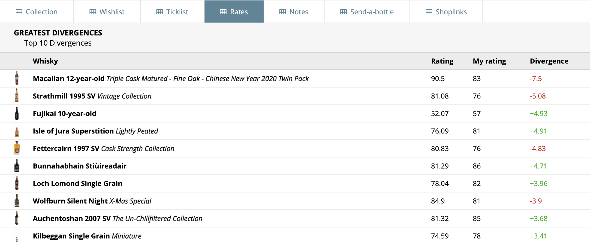

# WhiskyDivergence

> Display the greatest divergencies between an average Whiskybase rating and a user's rating.

When viewing the ratings of a user under `Lists` > `Rates`, WhiskyDivergence will display the 10 highest divergencies, whether they are positive or negative.

## Installation

0. Use a relatively new browser version.
1. Download the [Tampermonkey Extension](https://www.tampermonkey.net/) for your browser.
2. Go to the extension and create a new user script.
3. Replace the files in the editor with [this script](https://raw.githubusercontent.com/dominikbraun/whisky-divergence/main/whisky-divergence.js?token=AIXBQK35L6N2X4ENW4AQQ53BF5HYS).

**You're ready!** Give it a try and visit [my ratings](https://www.whiskybase.com/profile/dominikbraun/lists/ratings) as an example.
